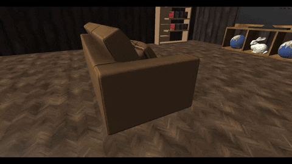
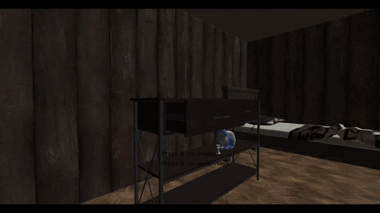
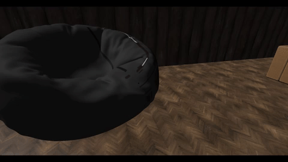
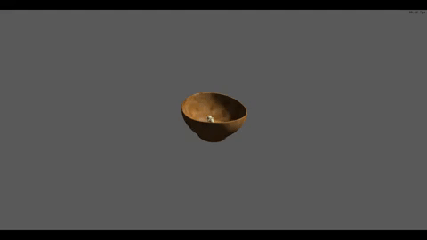

# Trabalho final FCG - Arthur Hendges e Gabriel Pereira
## Requisitos

**Malhas poligonais complexas:**  Peças de xadrez, objeto "console_table", entre outros.

**Transformações geométricas controladas pelo usuário:** Ao inspecionar objetos o usuário pode utilizar o mouse (botão esquerdo + arrastar) para controlar a rotação do objeto inspecionado. 

**Câmera livre e câmera look-at:** A câmera livre é a padrão durante o jogo e ao inspecionar utiliza-se a look-at.

**Instâncias de objetos:** Todas as peças de xadrez, em particular os peões onde há 16 instâncias do mesmo objeto.

**Três tipos de testes de intersecção**: Teste de colisão cubo-cubo ao colidir a maioria dos objetos, teste de colisão cubo-esfera ao colidir com o puff e teste reta-plano ao detectar para qual objeto o jogador está olhando.

**Modelos de Iluminação Difusa e Blinn-Phong:** O modelo de iluminação difusa foi aplicada no teto, nas paredes, sofá, entre outros. O modelo de iluminação de Blinn-Phong foi aplicada nas peças de xadrez, televisão, entre outros. 

**Modelos de Interpolação de Phong e Gouraud:** O modelo de interpolação de Phong é utilizado em quase todos objetos, exceto no "bowl" onde é utilizado o modelo de interpolação de Gouraud.

**Mapeamento de texturas em todos os objetos:** Todos os objetos possuem mapeamento de texturas.

**Movimentação com curva Bézier cúbica:** No início, meio e no fim do jogo, durante as "cutscenes" a câmera se movimenta utilizando uma curva de Bézier.

**Animações baseadas no tempo ($\Delta t$):** No início, meio e no fim do jogo, durante as "cutscenes" a câmera se movimenta de acordo com a variação de tempo.

## Contribuições:
Ambos integrantes adicionaram objetos, texturas, fizeram correção de bugs e refatorações. Além disso tiveram contribuições únicas:

Arthur: movimentação e colisão cubo-cubo, animações inicial e de coleta, movimentação com curva de Bézier.

Gabriel: inspeção dos objetos (skybox, rotação, detecção orientação do objeto), colisão cubo-esfera, animação final.

## Controles

W - move para frente. \
A - move para a esquerda. \
S - move para trás. \
D - move para a direita. \
F - abre e fecha gaveta, durante a inspeção também coleta objetos caso a peça esteja aparecendo.\
ESC - sai da inspeção e fecha o jogo após a animação final.
LSHIFT - corre.

Controles para debug/testes:\
H - inicia animação final do jogo.\
ESPAÇO - move para cima.\
CTRL - move para baixo.

OBS: os últimos dois controles só funcionam caso a variável y_axis_movement seja = true;

## Como executar

=== Windows
Para compilar e executar este projeto no Windows, utilize a IDE Code::Blocks e abra o arquivo Trabalho Final.cbp

## Objetivo
O objetivo do jogo é coletar todas as peças de xadrez. Para tal inspecione elas e aperte f em seguida. Algumas peças estão escondidas, para encontrá-las é necessário inspecionar os outros objetos da cena.